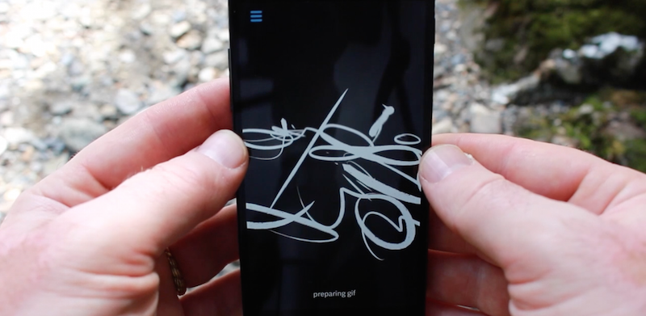

#ink space

ink space is a experimental drawing tool which uses the accelerometer on your android device to move the drawings you make in 3d.  It's part of the android experiments initiative. 

The project itself it fairly straight forward you can draw, move the phone by tilting in different directions, adjust line that you are drawing, create an animted line which pulses and re-draws itself and record an animated gif of whatever you make.   Double-tapping (or hitting the trash icon in the menu) clears the app.

As an artist I'm constantly thinking about new types of drawing tools, and what does drawing in the 21st century look like -- ink space is research in that realm.  If have a drawing basically in your hands, what does it look like to move around that drawing and experience more as a dimensional form that requires you to both draw and move.

You can see it in action here: 

It can save gifs (using the excellent [ofxGifEncoder](https://github.com/jesusgollonet/ofxGifEncoder)), like this: 

this is an [android experiment](https://www.androidexperiments.com/) 

## credits
 
This project owes a great deal to Amit Pitaru's [Rhonda](http://rhondaforever.com/), later versions of which I helped with, and to Matt Deslaurier's article ["drawing lines is hard"](http://mattdesl.svbtle.com/drawing-lines-is-hard). I'd also like to thank Anthony Tripaldi for android debugging and Arturo Castro (as well as the broader openframeworks community).  Also thanks to the folks from google creative lab for asking me to make something!  The app is written in openFrameworks 0.8.4.

# technical details

So let's nerd out a bit!  The way this app works is that it reads data from the accelerometer and manipulates drawings by rotating them based on the phone movement. Every new point that's entered is entered in 2d (ie, it has z value of zero) but as you move the phone it gets manipulated in 3d.  Typically most graphical applications don't change the underlying points of the model but alter a matrix (a box of numbers) to manipulate the points, but here, for several reasons, it's easier and faster to actually the manipulate the points.  That happens [here](https://github.com/ofZach/inkSpace/blob/master/src/ofApp.cpp#L272-L285
). 

So, we have a polyline (that's a set of points) that been manipulated to be in 3d - how do we go about drawing it?  Here, I have to thank the excelled [Drawing Lines is Hard](http://mattdesl.svbtle.com/drawing-lines-is-hard) article (see "Screen-Space Projected Lines") for some tips about how to project lines in the shader so that they are "volumentric" -- ie, we can pass in just the polyline data (plus a little extra info) and on the shader side compute the screen coordinates of a "ribbon" like shape to give the line depth.  We can even (as I do in this app) thin or thicken the line based on it's distance away from the viewer ([shader source](https://github.com/ofZach/inkSpace/blob/master/bin/data/shaders/lineShader.vert#L31-L35)).   This is how some [DOF line shaders work](https://vimeo.com/16407184), fyi.  

Another important trick is that opengl on mobile devices tends to be quite slow, and there are huge penalties for how you do your drawing -- ie, if you have lots of state changes, etc.   In our case, we want to draw lines as fast as possble, so we batch them into one giant VBO (vertex buffer object).  But, we don't want them to be connected.  There's a trick where you pass in a kind of degenerate shape between lines (by duplicating the last vertices of the previous line and the first vertices of the next line).  It's explained pretty well in this [apple developer document](https://developer.apple.com/library/ios/documentation/3DDrawing/Conceptual/OpenGLES_ProgrammingGuide/TechniquesforWorkingwithVertexData/TechniquesforWorkingwithVertexData.html).  Batching has huge implications for performance and the more you can put all your draw calls in one place the better on gles.   In our case, batching happens [here](https://github.com/ofZach/inkSpace/blob/master/src/lines/lineUtilities.h#L9-L16) -- we take the data from all the 3d lines and add them giant arrays of points, stroke widths, etc. 

There's also some issues with opengl and android where the context gets lost when you pause or close the app.  openFrameworks handles most of this, but I found I had to a fair amount of destroying and reallocating for things like FBOs and VBOs ([happens here](https://github.com/ofZach/inkSpace/blob/master/src/ofApp.cpp#L975-L1017)).  It's a pain but once you get the hang of it (and understand it) it's bearable. 

In this app we also talk to java side using the ofActivity.java (see [here](https://github.com/ofZach/inkSpace/blob/master/srcJava/cc/openframeworks/inkSpace/OFActivity.java#L65) and [here](https://github.com/ofZach/inkSpace/blob/master/src/ofApp.cpp#L7-L14)), we use JNI to handle the gif sharing as well as try to make the app fully fullscreen (ie, immersive mode).  This took a lot of trial and error to get right, but once we did, it was pretty powerful to call on the android sdk and use it for what it was good at.

## OF android tips

Here's a couple of tips for working with OF on android: 

* eclipse is kind of difficult IDE. I found myself fighting with it alot.  Once you get a working setup it's pretty straight forward but there's some pain there.  Many times I felt it was in a conversation with itself, and I was just eavesdropping.  The key to success I found was to learn little tricks to coax it into hapiness. And patience :)  
* I wound up putting #defines in my code so I could work in android and osx, and go back and forth.  Although I could code in eclipse, I was much happier in xcode and it was faster to iterate on changes.
* I created a few different workspaces when I wanted to try different settings or fix bugs.  That way I could keep a working workspace around but experiment with another SDK / config
* I used eclipse kepler with android-ndk-r9b, if that's helpful
* one of the most important settings was per project, right click -> properties -> c++ general -> code analysis.  Click "use project settings."   This helps prevent a somewhat schizophrenic behavior where eclipse will forget that it's "happy" with your project and go from compiling to throwing thousands of errors.
* I upped eclipses memory as per [this guide](https://wiki.eclipse.org/FAQ_How_do_I_increase_the_heap_size_available_to_Eclipse%3F)
* adb is your friend!  there are alot of things you can do with this tool, from listing folder contents, uploading and downloading APKs, reading logcat (ie adb -d logcat, this is super useful if you have an immediate crash).  Get to know adb -- I loved it. 
* ofLog() works pretty well with logCat, so I threw quite alot of ofLogs() in my code to see what was going on
* relative to IOS, putting the app on the play store was a piece of cake and putting the app on your devices was also super easy, almost a joy.  I have nightmares thinking of provisioning profiles.

